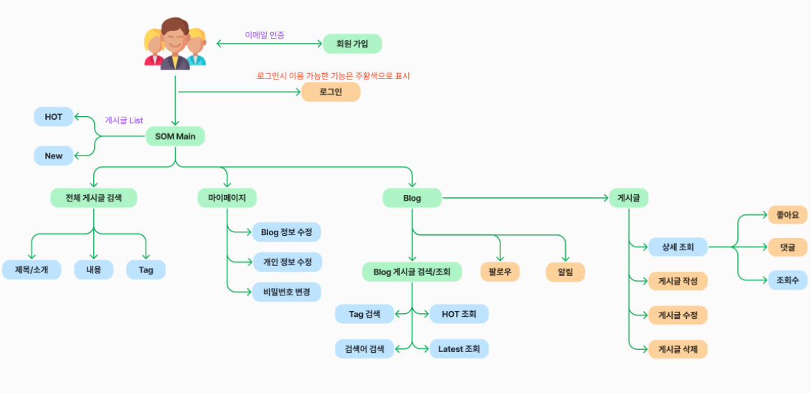
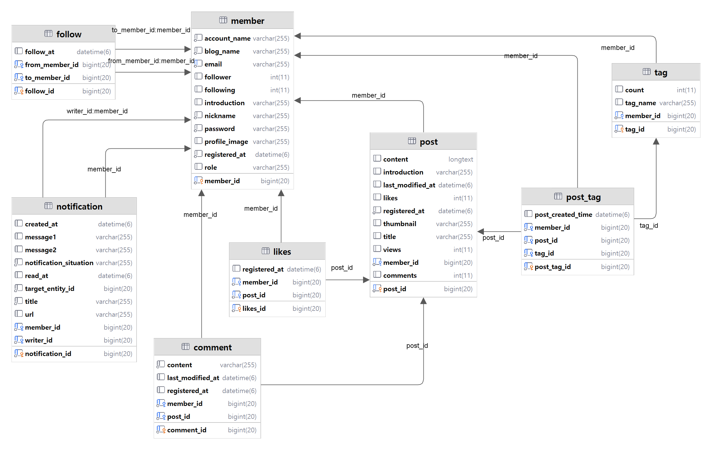

# SOM_BE
Story Of Me - Blog Platform Service

## Introduction
- 주요 기능 : 내 블로그를 만들고 운영할 수 있는 블로그 플랫폼
- 작업 기간 : 2024.01.20 ~ 2024.02
- 인원 구성 : 2명 (FE 1명, BE 1명) / BE 담당
- 배포 url : https://storyofme.vercel.app (2024.03.18 open 상태)

## UserFlow

## ERD

## 세부 기능 소개
### [회원 가입]
- email을 이용한 회원 인증, 회원 가입 (Google SMTP)
### [로그인 상태 관리]
- Spring Security와 JWT를 이용한 AccessToken, RefreshToken으로 로그인 상태 관리
- Access Token Blacklist를 이용한 로그아웃 처리 (Redis)
- Refresh Token 탈취 방지 (Redis)
### [게시글, 댓글]
- 게시글, 댓글 CRUD
- 게시글 작성, 수정 시 이미지 처리 로직 구현 (S3)
- 게시글 조회수 연속 증가 방지 (어뷰징 방지)
  -> 회원 당 하나의 게시글에 대한 조회수 증가는 30분마다 가능 (Redis)
### [태그(Tag)]
- Tag를 이용한 카테고리 관리
- 개인 블로그 Tag List, 각 Tag 별 게시글 개수 조회
- Tag 별 게시글 List 조회(검색) 가능
### [AWS S3 이미지 파일 관리]
- AWS S3를 이용한 이미지 객체 관리
- 프로필 사진, 게시글 이미지 업로드 (s3 url 생성)
- 사용되지 않는 이미지 처리 로직 구현
### [개인 블로그 게시글 조회]
- Hot, Latest, Tag로 List 조회 가능
- 게시글 검색
- List에서 사용할 데이터를 담을 MongoDB Document (caching) (MongoDB)
  -> 개인 블로그, 전체 블로그 게시글 List 조회 시 사용
### [SOM Main (타인 블로그 게시글 조회)]
- SOM 플랫폼을 이용하는 다른 사용자들이 쓴 글 조회 (Latest, Hot 정렬)
- 게시글 검색
### [알림]
- 게시글에 댓글 작성, 좋아요 눌렸을 때 실시간 알림 발생 (SSE